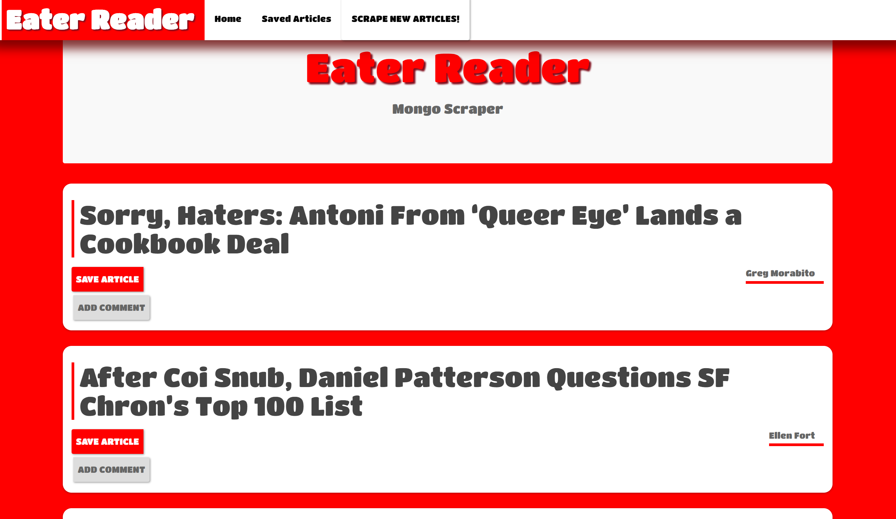
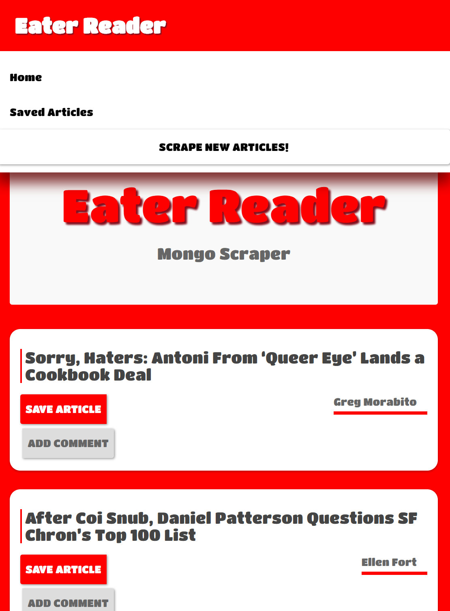

# EaterReader

This app scrapes headline articles from Eater.com and stores the links in a Mongo database. Users can save articles to be viewed under the saved tab. They can also add and save comments on specific articles.

## Getting Started

These instructions will get you a copy of the project up and running on your local machine for development and testing purposes. See deployment for notes on how to deploy the project on a live system.

### Prerequisites

#### Node.js 

- [Click here](https://nodejs.org/en/download/) to download

### MongoDB

open-source document database that provides high performance, high availability, and automatic scaling.
 
 - [Click here](https://docs.mongodb.com/manual/installation/) for installation instructions

```
Give examples
```

### Screen Shots




## Built With

### JavaScript

- [Handlebars.js](https://handlebarsjs.com/) is used for front end templating.

### MongoDB

- [Mongoose.js](http://mongoosejs.com/) is used to allow for schema based data modeling with MongoDB.


### Node.js
- [Express.js](http://expressjs.com/) a web framework for Node.
- [Request.js](https://www.npmjs.com/package/request) is used for HTTP calls.
- [Cheerio.js](https://www.npmjs.com/package/cheerio) is a node package that uses jQuery to facilitate parsing, manipulating and       rendering data.

## Deployment
 deployed with [Heroku](https://www.heroku.com/).


## Author

* **John Dekis**  - [PurpleBooth](https://github.com/johndekis)

## License

This project is licensed under the ISC License


